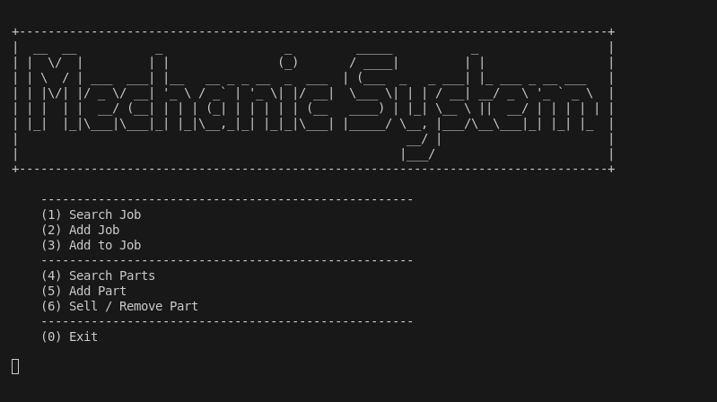

# Workshop Manager

A combined inventory and job management application

Workshop Manager is a console-based application designed to help small workshops, garages, and repair shops manage their parts inventory and customer jobs in a single, easy-to-use system. It provides functionality for searching, adding, and removing inventory, as well as creating, updating, and searching for jobs. The system is lightweight, and runs in the terminal.

---

## Features

* **Inventory Management**

  * Search parts by Part Number, Make, Model, or Year
  * Add new parts with descriptions, cost, RRP, and location
  * Record fitment information (Make, Model, Year combinations)
  * Track part quantities and locations
  * Remove or sell parts while updating stock levels

* **Job Management**

  * Search jobs by invoice number or customer name
  * Add new jobs with customer contact details and vehicle information
  * Record work already performed (including hours spent)
  * Record work still to be performed (with estimated hours)
  * Add job notes for customer or internal tracking

* **User Interface**

  * Clear, text-based menu system
  * Input validation to reduce entry errors
  * ASCII-style banner for clean navigation
  * Cross-platform console compatibility (Windows, macOS, Linux)

* **Test Data Included**

  * A suite of motorcycle-related parts and jobs for demonstration
  * Example parts include motorbike components with fitments
  * Example jobs include workshop invoices with vehicles and work items

---

## What is this software for?

This software is intended for small workshops and garages that need a **simple yet functional system** to keep track of parts and jobs. Instead of paper records or expensive paid software, Workshop Manager provides:

* A free, offline solution
* A searchable database of jobs and parts
* A straightforward workflow for adding, updating, and removing items

---

## How to Use

Once you run the file, follow the text prompts to enter in data - most screens end on an i nput, so you may need to click enter to continue in the program.

```
(1) Search Job  
(2) Add Job  
(3) Add to Job  
----------------------  
(4) Search Parts  
(5) Add Part  
(6) Sell / Remove Part  
----------------------  
(0) Exit  
```

* Choose an option by typing its number.
* Follow the prompts to enter job or part details.
* Use **Search** functions to review data already stored.
* Use **Add** functions to expand your records.
* Use **Remove** when a part is sold or used in a repair.

All entered data is stored and can be retrieved later.

---

## Installation

```
pip install Mechaic-system 
```
---

## Why did I create the Mechanic System?

My dad runs a local motorcycle repair shop, and the closed system that is capable of replicating this simple functionality costs at a minimum $400 a month AUD. This system has been designed to be itterated upon to add more of the features found in those more expensive systems, unit it is capable of being a fully fledged alternative to those systems.

---

## Inspiration

* Real-world workshop needs
* Motorcycle repair shops
* Small garages that rely on pen-and-paper

---

## Technologies Used

* Python
* JSON (for data storage)
* Console/Terminal UI

---

## Demo Data

The system is designed to have 'few' limitations to the type of data that can be entered into the system - making it better intergrate into existing systems.

---

## Notes

* This program is currently **console-based**, but can later be expanded into a GUI.
* Future improvements may include reporting features, export options, or a GUI frontend.

---

## UI Example

